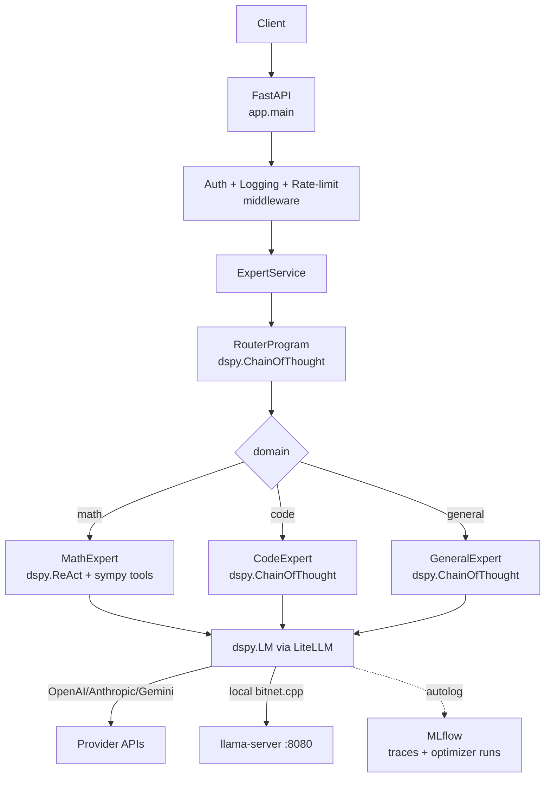

# dspy-sme-expert

**DSPy-powered multi-expert SME system.** A FastAPI service that routes
questions to domain-specialist `dspy.Module`s (math, code, general), with
LiteLLM provider routing, MLflow tracing, agentic hybrid RAG, and a
`dspy.Evaluate` harness driving MIPROv2 / GEPA optimization.

[](https://python.org)
[](https://fastapi.tiangolo.com)
[](https://dspy.ai)
[](https://opensource.org/licenses/MIT)

## Substrate-agnostic by design

The specialization layer (DSPy programs + optional ReAct tools + optional
RAG + compiled prompts) is the constant. The model running underneath is a
config flip. Four substrates are first-class and can be mixed per role via
`DSPY_LM_<ROLE>` env vars:

| Substrate | Best when | Setup |
|---|---|---|
| **HF Inference Providers** | Frontier-grade open weights, zero ops | env vars only |
| **Modal-hosted vLLM** | Specific HF base on a specific GPU, scales to zero | `modal deploy scripts/modal_serve.py` |
| **BitNet (local)** | Laptop latency, sovereign data, $0 marginal cost | `make bitnet-setup && make bitnet-serve` |
| **Frontier APIs** | Max capability, no time to specialize | env vars only |

See **[docs/deployment-modal-hf.md](docs/deployment-modal-hf.md)** for the full
playbook with copy-paste recipes for each. The hybrid sweet spot for most
teams: Router + General on a frontier API, Math + Code on a fine-tuned
Modal-hosted base or BitNet.

---

## What changed in v3.0

| Layer | v2 | v3 |
| --- | --- | --- |
| Expert layer | Hardcoded canned-string stubs | `dspy.Module`s with typed signatures |
| Math | Regex routing + sympy fallback | `dspy.ReAct(SolveMathProblem, tools=[sympy_*])` + deterministic fast-path |
| Code | Pattern matching + template strings | `dspy.ChainOfThought(GenerateCode)` |
| General | Random pick from canned responses | `dspy.ChainOfThought(AnswerGeneralQuestion)` |
| Routing | Hardcoded keyword `if/elif` | `RouterProgram` (`dspy.ChainOfThought`) — optimizable |
| Multi-provider | Three SDKs imported, none called | `dspy.LM` over LiteLLM, per-role fallback chains |
| Optimization | n/a | `MIPROv2` / `GEPA` via `scripts/optimize.py`, persisted to `compiled/` |
| Observability | structlog + Prometheus | + `mlflow.dspy.autolog()` (OTel traces, optimizer runs) |
| Package mgmt | `requirements.txt` + `pyproject.toml` (drift) | `uv` + single `pyproject.toml` + `uv.lock` |
| Python | 3.9+ | 3.12+ |
| Pydantic | mixed v1/v2 | v2 throughout |
| JWT | `python-jose` (unmaintained) | `PyJWT` |
| BitNet | name only | optional `bitnet.cpp` provider via OpenAI-compatible llama-server |

## Architecture



## Quickstart

```bash
# 1. Get uv if you don't already have it.
curl -LsSf https://astral.sh/uv/install.sh | sh

# 2. Install everything.
uv sync --all-extras

# 3. Configure providers.
cp .env.example .env
$EDITOR .env   # at minimum set OPENAI_API_KEY (or override DSPY_LM_*)

# 4. Run.
uv run uvicorn app.main:app --reload
# -> http://localhost:8000/docs
```

One-shot query without spinning up the server:

```bash
uv run dspy-sme query "What is the derivative of x^3 + 2x?" --domain math
```

## Optimization loop

```bash
# Baseline + MIPROv2 light compile (saves to compiled/math.json)
make optimize-math

# Or use GEPA for reflection-based prompt evolution
make optimize-math-gepa
```

Compiled programs are loaded automatically at startup. To re-run the eval
harness against the compiled programs:

```bash
RUN_EVAL=1 uv run pytest tests/eval -v -s
```

## Picking a substrate

The full comparison + copy-paste recipes live in **[docs/deployment-modal-hf.md](docs/deployment-modal-hf.md)**.
The 30-second version:

**HF Inference Providers** — zero ops, frontier open weights, billed via HF:

```bash
export HF_TOKEN=hf_...
export DSPY_LM_GENERAL="huggingface/auto/meta-llama/Llama-3.3-70B-Instruct"
```

**Modal-hosted vLLM** — specific HF base on a specific GPU, scales to zero:

```bash
modal deploy scripts/modal_serve.py    # one shot
export DSPY_LM_CODE="openai/Qwen/Qwen2.5-Coder-32B-Instruct"
export DSPY_LM_CODE_API_BASE="https://<workspace>--dspy-sme-vllm-serve.modal.run/v1"
export DSPY_LM_CODE_API_KEY="$YOUR_MODAL_KEY"
```

**Modal-hosted fine-tuning** — Unsloth + TRL on H100, adapter pushed to HF Hub:

```bash
modal run scripts/modal_finetune.py::train \
    --base-model meta-llama/Llama-3.3-70B-Instruct \
    --dataset-repo your-org/your-domain-sft \
    --output-repo your-org/llama-3.3-70b-domain-lora
```

**BitNet (local)** — laptop latency, sovereign, $0 marginal cost:

```bash
make bitnet-setup && make bitnet-serve
export DSPY_LM_MATH="openai/bitnet-b1.58-2B-4T"
export DSPY_LM_MATH_API_BASE="http://localhost:8080/v1"
export DSPY_LM_MATH_API_KEY="local"
```

The 2B BitNet model runs on CPU at 5-7 tok/s — useful for laptop dev, sovereign
deployments, or PII-sensitive workloads. The capability ceiling is the 2B
envelope; pick BitNet when the ceiling isn't the binding constraint.

## Observability

Set `MLFLOW_TRACKING_URI` (or run `docker compose up mlflow`) to enable
`mlflow.dspy.autolog()`. Every module call produces an OpenTelemetry span;
every optimizer run is logged as an MLflow run with the baseline and
optimized scores, so you can A/B compiled artifacts in the UI.

## API

| Method | Path | Description |
| --- | --- | --- |
| GET  | `/health`, `/health/live`, `/health/ready` | Probes |
| GET  | `/metrics` | Prometheus scrape endpoint |
| GET  | `/api/v1/experts` | List registered experts |
| POST | `/api/v1/query` | Route a question (auto or `domain=...`) |
| POST | `/api/v1/collaborate` | Fan out to several experts in parallel |
| POST | `/api/v1/feedback` | Submit feedback on a previous query |

Interactive docs at `/docs` (Swagger) and `/redoc`.

## Project layout

```
app/
├── main.py                  FastAPI app + lifespan
├── cli.py                   `dspy-sme` console script
├── llm.py                   DSPy LM configuration (LiteLLM + MLflow)
├── config.py                Settings (Pydantic v2)
├── observability.py         JSON logging + Prometheus metrics
├── dspy_modules/            Signatures + Modules (the model code)
│   ├── signatures.py
│   ├── router.py
│   ├── math_module.py
│   ├── code_module.py
│   └── general_module.py
├── experts/                 Thin wrappers exposing the API contract
├── services/expert_service.py
├── api/endpoints/           FastAPI routes
├── middleware/              CORS, auth (PyJWT), logging, errors
├── schemas/                 Pydantic v2 request/response models
└── ...
scripts/
├── optimize.py              MIPROv2 / GEPA compile pipeline
├── bitnet_setup.sh          Build bitnet.cpp + pull the model
└── bitnet_serve.sh          Run the llama-server
tests/
├── test_experts.py          Wiring smoke tests (no LM)
└── eval/                    dspy.Evaluate gold sets + metrics (RUN_EVAL=1)
compiled/                    Optimized programs land here (gitignored)
```

## Development

```bash
make install      # uv sync --all-extras
make test         # unit tests (no LM)
make test-eval    # eval tests (requires provider keys, RUN_EVAL=1)
make lint         # ruff + mypy
make format       # ruff format + fix
make build        # docker build (production target)
```

## License

MIT. See `LICENSE`.
