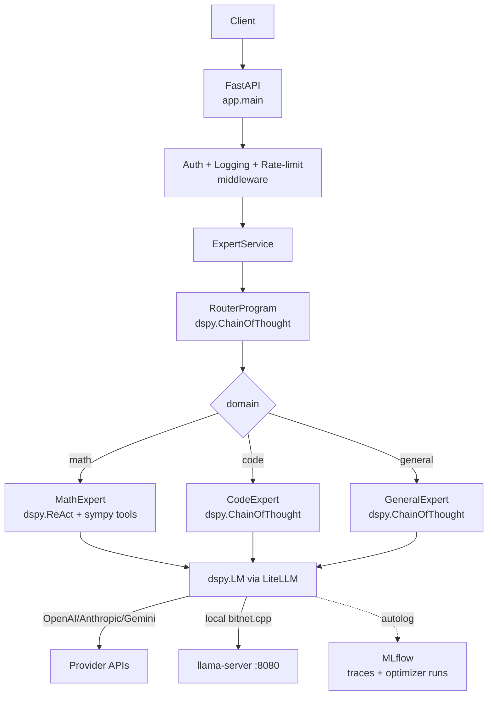

# dspy-sme-expert

**DSPy-powered multi-expert SME system.** A FastAPI service that routes
questions to domain-specialist `dspy.Module`s (math, code, general), with
LiteLLM provider routing, MLflow tracing, optional local inference via
`bitnet.cpp`, and a `dspy.Evaluate` harness driving MIPROv2 / GEPA
optimization.

[](https://python.org)
[](https://fastapi.tiangolo.com)
[](https://dspy.ai)
[](https://opensource.org/licenses/MIT)

> Previously branded "BitNet SME Expert v2.0". Renamed in v3.0 because the
> previous incarnation was a multi-provider FastAPI shell with hardcoded
> string stubs in place of every expert, and zero DSPy or BitNet code. v3
> rebuilds the expert layer on DSPy 3.2 and adds `bitnet.cpp` as an
> _optional_ local provider rather than a marketing centerpiece.

---

## What changed in v3.0

| Layer | v2 | v3 |
| --- | --- | --- |
| Expert layer | Hardcoded canned-string stubs | `dspy.Module`s with typed signatures |
| Math | Regex routing + sympy fallback | `dspy.ReAct(SolveMathProblem, tools=[sympy_*])` + deterministic fast-path |
| Code | Pattern matching + template strings | `dspy.ChainOfThought(GenerateCode)` |
| General | Random pick from canned responses | `dspy.ChainOfThought(AnswerGeneralQuestion)` |
| Routing | Hardcoded keyword `if/elif` | `RouterProgram` (`dspy.ChainOfThought`) — optimizable |
| Multi-provider | Three SDKs imported, none called | `dspy.LM` over LiteLLM, per-role model selection |
| Optimization | n/a | `MIPROv2` / `GEPA` via `scripts/optimize.py`, persisted to `compiled/` |
| Observability | structlog + Prometheus | + `mlflow.dspy.autolog()` (OTel traces of module calls) |
| Package mgmt | `requirements.txt` + `pyproject.toml` (drift) | `uv` + single `pyproject.toml` + `uv.lock` |
| Python | 3.9+ | 3.12+ |
| Pydantic | mixed v1/v2 | v2 throughout |
| JWT | `python-jose` (unmaintained) | `PyJWT` |
| BitNet | name only | optional `bitnet.cpp` provider via OpenAI-compatible llama-server |

## Architecture



## Quickstart

> **Naming:** the GitHub repository is `bitnet-sme-expert` (a historical name from
> the v2 era); the Python package, CLI, and import path are all `dspy-sme-expert`
> / `dspy_sme`. Same project — the repo just wasn't renamed.

```bash
# 0. Clone.
git clone https://github.com/OtotaO/bitnet-sme-expert.git
cd bitnet-sme-expert

# 1. Get uv if you don't already have it.
curl -LsSf https://astral.sh/uv/install.sh | sh

# 2. Install everything.
uv sync --all-extras

# 3. Configure providers.
cp .env.example .env
$EDITOR .env   # at minimum set OPENAI_API_KEY (or override DSPY_LM_*)

# 4. Run.
uv run uvicorn app.main:app --reload
# -> http://localhost:8000/docs
```

One-shot query without spinning up the server:

```bash
uv run dspy-sme query "What is the derivative of x^3 + 2x?" --domain math
```

## Optimization loop

```bash
# Baseline + MIPROv2 light compile (saves to compiled/math.json)
make optimize-math

# Or use GEPA for reflection-based prompt evolution
make optimize-math-gepa
```

`MIPROv2 (auto=light)` is a solid default for our small (~50-example) train sets
and is what produced the committed +0.18 math win. For instruction-heavy gains,
**GEPA** (reflective prompt evolution, an ICLR 2026 result reported to beat
MIPROv2 by >10% on such tasks) is the stronger lever and is worth preferring as
the gold sets grow — especially if you have its metric return short natural-language
feedback, which is where its edge comes from.

Compiled programs are loaded automatically at startup. To re-run the eval
harness against the compiled programs:

```bash
RUN_EVAL=1 uv run pytest tests/eval -v -s
```

## Eval gate & receipts

The gold sets ship as a committed **train/holdout split** so a reported score
can't be an overfit-to-the-eval-set artifact (`tests/eval/loader.py`):

| Domain | Train | Holdout | Pass threshold (holdout) |
| --- | ---: | ---: | ---: |
| math | 50 | 50 | 0.60 |
| code | 50 | 50 | 0.60 |
| general | 50 | 50 | 0.70 |

`scripts/optimize.py` compiles on `train` and scores on `holdout`, writing a
dated receipt to `eval/receipts/<domain>-<optimizer>.json` (baseline, compiled,
delta, LM, split sizes). The `Eval` workflow runs `scripts/run_eval.py` against
the holdout set on every PR to `main` as a required check (see
`.github/workflows/eval.yml`). Eval is pinned to `temperature=0` so scores are
reproducible.

### Committed receipts (`openai/gpt-4o-mini`, temp 0, 2026-06-04)

Baseline holdout scores (no compiled program loaded), on the 50-item holdouts:

| Domain | N (holdout) | Score | Threshold | Pass |
| --- | ---: | ---: | ---: | :---: |
| math | 50 | 0.62 | 0.60 | ✅ |
| code | 50 | 1.00 | 0.60 | ✅ |
| general | 50 | 1.00 | 0.70 | ✅ |

Math sits just above its threshold on the harder 50-item set (it scored 0.73 on
the earlier easy 15), so the gate genuinely bites. Code and general saturate the
substring metrics at 1.00 — those metrics are lenient proxies (see the eval
follow-ups issue), not evidence the models are perfect.

MIPROv2 (`auto=light`) compile — math (`eval/receipts/math-miprov2.json`):

| Domain | Baseline | Compiled | Delta |
| --- | ---: | ---: | ---: |
| math | 0.62 | 0.80 | **+0.18** |

**A real, reproducible win** on the held-out set (50 train / 50 holdout,
`gpt-4o-mini`, temp 0). Worth noting *why* this is trustworthy: the first
committed receipt for this domain was a **−0.13** on the earlier 15-item holdout
— MIPROv2 looked like it *hurt*. That was a small-sample artifact; on the larger
gold set the optimizer genuinely lifts math from 0.62 to 0.80. We kept the
negative receipt while it stood (project policy: never massage a non-positive
delta) and replaced it only when a bigger, honest measurement superseded it.
`code` and `general` were not compiled: their substring metrics already saturate
the holdout at 1.00, leaving no measurable headroom until those metrics are
tightened.

## Optional: local inference with `bitnet.cpp`

`bitnet.cpp` ships an OpenAI-compatible `llama-server` (built during its
`setup_env.py` cmake step). Wire it up as any other `dspy.LM`:

```bash
# One-time: clone, build, download the b1.58 2B 4T model (~3 GB)
make bitnet-setup

# Serve it locally on :8080
make bitnet-serve

# Tell DSPy to use it for the math expert
export DSPY_LM_MATH="openai/bitnet"
export DSPY_LM_MATH_API_BASE="http://localhost:8080/v1"
export DSPY_LM_MATH_API_KEY_ENV="BITNET_DUMMY_KEY"
export BITNET_DUMMY_KEY="local"
```

The 2B-4T BitNet model is a useful local fallback for PII-sensitive or offline
workloads. Its real edge is **footprint and energy**, not raw quality: ~0.4 GB
non-embedding memory and ~10× lower energy than comparable fp16 small models, at
competitive-but-not-superior ~2B quality (it trails Qwen2.5-1.5B on MMLU).
Throughput is hardware-dependent — measure it on your own box:

```bash
make bitnet-demo   # sends a fixed prompt through the DSPy path, prints
                   # measured tok/s, writes eval/receipts/bitnet-<date>.txt
```

(Microsoft's model card reports ~29 ms/token CPU decode latency for the
b1.58-2B-4T model via `bitnet.cpp` — the `transformers` path gets none of that
speedup. The widely-quoted "5-7 tok/s" figure is the **100B** BitNet, not this
2B model. This repo ships no measured figure of its own until `make bitnet-demo`
produces one. If you want a larger local ecosystem, a Q4 Qwen3-1.7B / Gemma-3-1B
on llama.cpp drops into the same `openai/`-compatible provider slot.)

## Observability

Set `MLFLOW_TRACKING_URI` (or run `docker compose up mlflow`) to enable
`mlflow.dspy.autolog()`. Every module call at serve/eval time produces an
OpenTelemetry span you can inspect in the MLflow UI.

When `MLFLOW_TRACKING_URI` is set, `scripts/optimize.py` also logs each optimizer
run as an MLflow run — params plus the baseline/optimized/delta metrics, with the
committed receipt attached as an artifact — so compiled programs are A/B-comparable
in the UI. The committed receipts under `eval/receipts/` remain the source of
truth regardless of whether MLflow is configured.

## API

| Method | Path | Description |
| --- | --- | --- |
| GET  | `/health`, `/health/live`, `/health/ready` | Probes |
| GET  | `/metrics` | Prometheus scrape endpoint |
| GET  | `/api/v1/experts` | List registered experts |
| POST | `/api/v1/query` | Route a question (auto or `domain=...`) |
| POST | `/api/v1/collaborate` | Fan out to several experts in parallel |
| POST | `/api/v1/feedback` | Submit feedback on a previous query (logged, not yet persisted) |
| POST | `/api/v1/fine-tune` | Kick off a fine-tuning job (experimental; admin-gated) |
| GET  | `/api/v1/training/status/{job_id}` | Fine-tuning job status (experimental) |
| GET  | `/api/v1/training/jobs` | List fine-tuning jobs (experimental) |
| POST | `/cache/clear` | Clear the response cache (admin-gated) |
| GET  | `/cache/stats` | Response-cache statistics |

Interactive docs at `/docs` (Swagger) and `/redoc`.

## Project layout

```
app/
├── main.py                  FastAPI app + lifespan
├── cli.py                   `dspy-sme` console script
├── llm.py                   DSPy LM configuration (LiteLLM + MLflow)
├── config.py                Settings (Pydantic v2)
├── observability.py         JSON logging + Prometheus metrics
├── dspy_modules/            Signatures + Modules (the model code)
│   ├── signatures.py
│   ├── router.py
│   ├── math_module.py
│   ├── code_module.py
│   └── general_module.py
├── experts/                 Thin wrappers exposing the API contract (see experts/README.md)
├── services/                ExpertService (routing, collaborate, fine-tuning)
├── api/endpoints/           FastAPI routes (core + fine_tuning)
├── middleware/              CORS, auth (PyJWT), logging, errors
├── schemas/                 Pydantic v2 request/response models
├── models/                  Abstract expert base + ORM models
├── retrieval/               Optional hybrid RAG (LanceDB + BGE), [rag] extra
├── core/                    Exceptions and shared internals
├── database.py              Engine + session bootstrap
└── ...
scripts/
├── optimize.py              MIPROv2 / GEPA compile pipeline (writes eval/receipts/)
├── run_eval.py              Holdout eval runner (the CI gate)
├── bitnet_setup.sh          Build bitnet.cpp + pull the model
├── bitnet_serve.sh          Run the llama-server
└── bitnet_demo.sh           Measure local tok/s (writes a receipt)
tests/
├── test_experts.py          Wiring smoke tests (no LM)
└── eval/                    loader (train/holdout split) + gold sets + metrics (RUN_EVAL=1)
eval/receipts/               Committed optimizer/throughput receipts
compiled/                    Optimized programs land here (gitignored)
```

## Docs

- [`docs/strategy.md`](docs/strategy.md) — strategy, goals, outcomes, and honest current state.
- [`docs/specialization.md`](docs/specialization.md) — the BitNet + DSPy specialization playbook.
- [`app/experts/README.md`](app/experts/README.md) — how to add a new domain expert end to end.
- [`CONTRIBUTING.md`](CONTRIBUTING.md) — dev loop, the eval/optimize cycle, and the receipts policy.

## Development

```bash
make install      # uv sync --all-extras
make test         # unit tests (no LM)
make test-eval    # eval tests (requires provider keys, RUN_EVAL=1)
make lint         # ruff + mypy
make format       # ruff format + fix
make build        # docker build (production target)
```

## License

MIT. See `LICENSE`.
