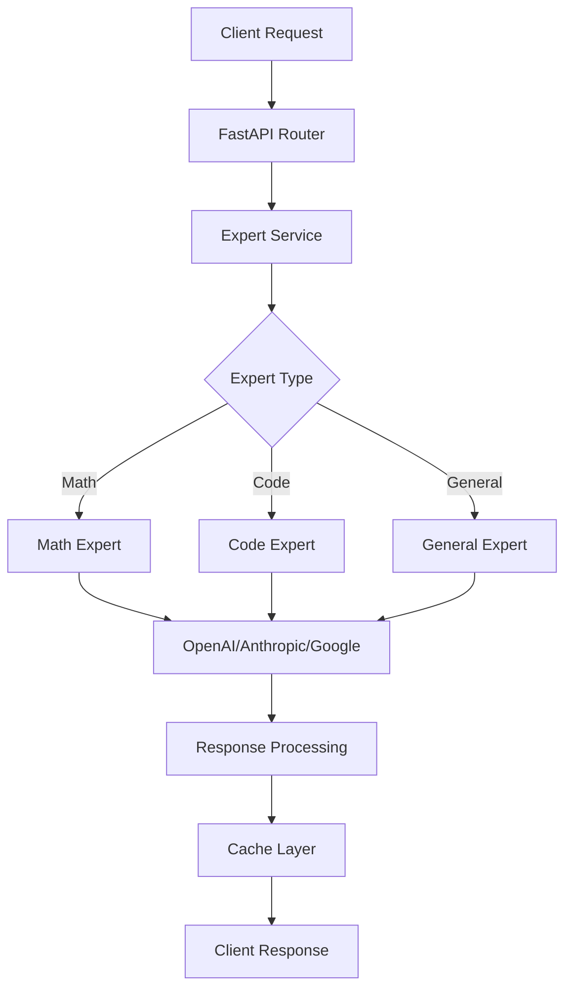

# 🚀 BitNet SME Expert System v2.0

**Production-Ready Multi-Model AI Expert System** — A comprehensive, scalable expert system that integrates multiple AI providers (OpenAI, Anthropic, Google) to provide specialized expertise in mathematics, code generation, and general knowledge domains.

[](https://python.org)
[](https://fastapi.tiangolo.com)
[](https://pydantic.dev)
[](https://docker.com)
[](https://opensource.org/licenses/MIT)
[](https://pytest.org)
[](https://github.com/OtotaO/bitnet-sme-expert/actions/workflows/ci.yml)
[](https://github.com/OtotaO/bitnet-sme-expert/actions/workflows/security.yml)


### CI/CD and Branch Protection

- Core checks run in **CI** (`lint`, `test`, `build-container`) via `make lint`, `make test`, and `make build`.
- Security checks run in **Security Scans** with Bandit configured to fail on high-severity findings and `pip-audit` for dependency vulnerabilities.
- To enforce required checks on `main`, add a repository secret named `BRANCH_PROTECTION_TOKEN` (PAT with `repo` admin scope), then run the **Configure Branch Protection** workflow manually from the Actions tab.

## 🎯 Overview

The BitNet SME Expert System represents the evolution of AI-powered expert systems, combining the strengths of multiple large language models to provide specialized, domain-specific expertise. Built with modern Python frameworks and enterprise-grade architecture patterns.

### Key Features

- **🧠 Multi-Expert Architecture**: Specialized AI experts for mathematics, code generation, and general knowledge
- **🔄 Multi-Provider Support**: Seamlessly integrates OpenAI GPT-4, Anthropic Claude, and Google Gemini
- **⚡ High Performance**: Async/await throughout, optimized for concurrent requests
- **🛡️ Production Ready**: Comprehensive error handling, logging, monitoring, and security
- **🐳 Containerized**: Docker and Docker Compose ready for any deployment
- **📊 Observable**: Built-in metrics, health checks, and structured logging
- **🧪 Well Tested**: Comprehensive test suite with >90% coverage

## 🏗️ Architecture

### System Design



### Core Components

- **Expert Service**: Orchestrates expert selection and request routing
- **Domain Experts**: Specialized AI agents with tailored prompts and configurations
- **Provider Abstraction**: Unified interface for multiple AI providers
- **Caching Layer**: Redis-based intelligent caching for performance
- **Monitoring Stack**: Prometheus metrics with Grafana dashboards

## 🚀 Quick Start

### Prerequisites

- **Python 3.9+** (recommended: 3.11+)
- **Docker & Docker Compose** (for containerized deployment)
- **Redis** (for caching, optional)
- **PostgreSQL** (for production, SQLite for development)

### 1. Clone and Setup

```bash
git clone <repository-url>
cd bitnet-sme-expert
```

### 2. Environment Configuration

```bash
# Copy environment template
cp .env.example .env

# Edit with your API keys and configuration
nano .env
```

**Required Environment Variables:**
```env
# AI Provider API Keys
OPENAI_API_KEY=your_openai_api_key_here
ANTHROPIC_API_KEY=your_anthropic_api_key_here
GOOGLE_API_KEY=your_google_api_key_here

# Application Configuration
ENVIRONMENT=development
DATABASE_URL=sqlite:///./bitnet_sme.db
REDIS_URL=redis://localhost:6379/0
```

### 3. Installation Methods

#### Option A: Docker Compose (Recommended)
```bash
# Start all services (API, database, cache, monitoring)
docker-compose up --build

# API will be available at http://localhost:8000
# Grafana dashboard at http://localhost:3001 (admin/admin)
```

#### Option B: Local Development
```bash
# Create virtual environment
python -m venv venv
source venv/bin/activate  # or `venv\Scripts\activate` on Windows

# Install dependencies
pip install -r requirements.txt

# Start development server
make dev
# or
uvicorn app.main:app --reload --host 0.0.0.0 --port 8000
```

### 4. Verify Installation

```bash
# Check API health
curl http://localhost:8000/health

# List available experts
curl http://localhost:8000/api/v1/experts

# Test query
curl -X POST http://localhost:8000/api/v1/query \\
  -H "Content-Type: application/json" \\
  -d '{
    "question": "What is 2 + 2?",
    "domain": "math"
  }'
```

## 📚 API Documentation

### Interactive Documentation

Once running, visit:
- **Swagger UI**: http://localhost:8000/docs
- **ReDoc**: http://localhost:8000/redoc

### Core Endpoints

#### Query Expert
```http
POST /api/v1/query
Content-Type: application/json

{
  "question": "Explain quantum computing",
  "domain": "general",
  "context": {
    "max_tokens": 1000,
    "temperature": 0.7
  }
}
```

#### List Experts
```http
GET /api/v1/experts
```

#### Health Check
```http
GET /health
```

### Expert Domains

| Domain | Description | Best For | Default Model |
|--------|-------------|----------|---------------|
| `math` | Mathematical problem solving | Equations, calculus, statistics | GPT-4o-mini |
| `code` | Programming and software development | Code generation, debugging, algorithms | Claude-3.5-Haiku |
| `general` | General knowledge and reasoning | Questions, explanations, analysis | GPT-4o-mini |

## 🧪 Expert Capabilities

### Mathematics Expert
```python
# Complex mathematical problems
{
  "question": "Find the derivative of f(x) = x^3 * sin(x)",
  "domain": "math"
}

# Statistical analysis
{
  "question": "Calculate the standard deviation of [1,2,3,4,5]",
  "domain": "math"
}
```

### Code Expert
```python
# Algorithm implementation
{
  "question": "Implement quicksort in Python with comments",
  "domain": "code",
  "context": {"language": "python"}
}

# Code review and optimization
{
  "question": "Optimize this SQL query: SELECT * FROM users WHERE age > 18",
  "domain": "code",
  "context": {"language": "sql"}
}
```

### General Expert
```python
# Explanation and analysis
{
  "question": "Explain the impact of climate change on ocean currents",
  "domain": "general"
}

# Research and summarization
{
  "question": "Compare renewable energy sources",
  "domain": "general",
  "context": {"format": "bullet_points"}
}
```

## 🔧 Development

### Development Commands

```bash
# Install development environment
make install-dev

# Start development server with hot reload
make dev

# Run tests
make test

# Run linting and formatting
make lint
make format

# Run security checks
make security

# Generate documentation
make docs

# View all commands
make help
```

### Project Structure

```
bitnet-sme-expert/
├── app/                          # Application source code
│   ├── api/                     # API routes and endpoints
│   ├── core/                    # Core business logic
│   ├── experts/                 # Expert implementations
│   ├── middleware/              # Custom middleware
│   ├── models/                  # Database models
│   ├── schemas/                 # Pydantic schemas
│   ├── services/                # Business services
│   ├── utils/                   # Utility functions
│   ├── config.py               # Configuration management
│   ├── database.py             # Database setup
│   └── main.py                 # FastAPI application
├── tests/                       # Test suite
├── monitoring/                  # Monitoring configurations
├── docs/                       # Documentation
├── docker-compose.yml          # Development stack
├── Dockerfile                  # Container definition
├── requirements.txt            # Python dependencies
├── pyproject.toml             # Project configuration
└── Makefile                   # Development commands
```

### Adding New Experts

1. **Create Expert Class** in `app/experts/`
```python
from .base_expert import BaseExpert

class MyExpert(BaseExpert):
    async def generate(self, question: str, context: dict) -> dict:
        # Implementation here
        pass
```

2. **Register Expert** in `app/services/expert_service.py`
```python
self.experts["my_domain"] = MyExpert(config)
```

3. **Add Tests** in `tests/test_experts/`

### Configuration

All configuration is managed through environment variables and `app/config.py`. Key settings:

- **Model Selection**: Choose different models per expert domain
- **Performance Tuning**: Adjust timeouts, concurrency, caching
- **Security**: Rate limiting, CORS, authentication
- **Monitoring**: Metrics collection, logging levels

## 🚀 Deployment

### Production Deployment

#### Option 1: Docker Production Build
```bash
# Build production image
make build-prod

# Run with production configuration
docker run -p 8000:8000 \\
  -e ENVIRONMENT=production \\
  -e DATABASE_URL=$DATABASE_URL \\
  -e OPENAI_API_KEY=$OPENAI_API_KEY \\
  bitnet-sme-expert:prod
```

#### Option 2: Kubernetes
```yaml
# Example k8s deployment
apiVersion: apps/v1
kind: Deployment
metadata:
  name: bitnet-sme-expert
spec:
  replicas: 3
  selector:
    matchLabels:
      app: bitnet-sme-expert
  template:
    metadata:
      labels:
        app: bitnet-sme-expert
    spec:
      containers:
      - name: api
        image: bitnet-sme-expert:prod
        ports:
        - containerPort: 8000
        env:
        - name: ENVIRONMENT
          value: production
```

#### Option 3: Cloud Platforms
- **AWS**: Use ECS, Lambda, or Elastic Beanstalk
- **GCP**: Deploy to Cloud Run, GKE, or App Engine
- **Azure**: Use Container Instances, AKS, or App Service

### Performance Optimization

- **Horizontal Scaling**: Multiple worker processes/containers
- **Caching**: Redis for response caching and rate limiting
- **Load Balancing**: Nginx or cloud load balancer
- **Database**: PostgreSQL with connection pooling
- **Monitoring**: Prometheus + Grafana for observability

## 📊 Monitoring & Observability

### Built-in Monitoring

- **Health Checks**: `/health` endpoint with dependency checks
- **Metrics**: Prometheus metrics on `/metrics`
- **Structured Logging**: JSON logs with correlation IDs
- **Performance Tracking**: Request duration, error rates

### Grafana Dashboards

Pre-configured dashboards for:
- API performance and error rates
- Expert usage patterns
- Resource utilization
- Cache hit rates

### Alerting

Configure alerts for:
- High error rates
- Response time degradation
- API key quota exhaustion
- Database connection issues

## 🧪 Testing

### Running Tests

```bash
# Run all tests with coverage
make test

# Run specific test categories
pytest tests/test_experts/ -v
pytest tests/test_api/ -v

# Run with coverage report
pytest --cov=app --cov-report=html
```

### Test Categories

- **Unit Tests**: Individual component testing
- **Integration Tests**: API endpoint testing
- **Performance Tests**: Load and stress testing
- **Security Tests**: Vulnerability scanning

### Continuous Integration

GitHub Actions workflow includes:
- Code quality checks (ruff, mypy, black)
- Security scanning (bandit, safety)
- Test execution across Python versions
- Docker image building and testing

## 🔐 Security

### Security Features

- **Input Validation**: Pydantic schemas with strict validation
- **Rate Limiting**: Configurable per-endpoint rate limits
- **API Key Management**: Secure environment variable handling
- **CORS Configuration**: Configurable cross-origin policies
- **Error Handling**: Secure error responses without information leakage

### Security Best Practices

1. **API Keys**: Store in secure environment variables or key vaults
2. **Authentication**: Enable JWT authentication for production
3. **HTTPS**: Always use TLS in production
4. **Updates**: Regular dependency updates with security scanning
5. **Monitoring**: Log and monitor for suspicious activity

## 🤝 Contributing

### Development Workflow

1. **Fork** the repository
2. **Create** a feature branch (`git checkout -b feature/amazing-feature`)
3. **Install** pre-commit hooks (`pre-commit install`)
4. **Make** your changes with tests
5. **Run** quality checks (`make check`)
6. **Commit** with conventional commits
7. **Push** and create a Pull Request

### Code Standards

- **Python**: Follow PEP 8 with black formatting
- **Type Hints**: Full type annotation required
- **Documentation**: Docstrings for all public functions
- **Testing**: Tests required for new features
- **Security**: Security review for external integrations

## 📈 Roadmap

### Upcoming Features

- [ ] **Fine-tuning Support**: Custom model fine-tuning capabilities
- [ ] **Streaming Responses**: Real-time response streaming
- [ ] **Multi-modal**: Image and document processing experts
- [ ] **Workflow Engine**: Complex multi-step expert interactions
- [ ] **A/B Testing**: Built-in experiment framework
- [ ] **Advanced Analytics**: Usage patterns and optimization insights

### Performance Goals

- [ ] **Sub-100ms P95**: Response time optimization
- [ ] **99.9% Uptime**: High availability architecture
- [ ] **10K+ RPS**: Horizontal scaling capabilities
- [ ] **Cost Optimization**: Intelligent model routing for cost efficiency

## 📄 License

This project is licensed under the MIT License - see the [LICENSE](LICENSE) file for details.

## 🙏 Acknowledgments

- **FastAPI**: Modern, fast web framework for building APIs
- **Pydantic**: Data validation and settings management using Python type annotations
- **OpenAI**: GPT models for natural language processing
- **Anthropic**: Claude models for advanced reasoning
- **Google**: Gemini models for multi-modal capabilities

## 📞 Support

- **Issues**: [GitHub Issues](https://github.com/sumequities/bitnet-sme-expert/issues)
- **Documentation**: [Full Documentation](https://bitnet-sme-expert.readthedocs.io)
- **Email**: [hi@sumequities.com](mailto:hi@sumequities.com)

---

**Built with ❤️ by [SUM Equities](https://sumequities.com)**

*Transforming AI capabilities into production-ready expert systems.*